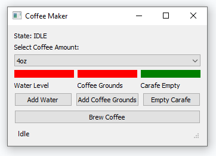
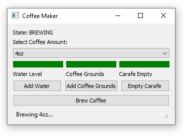
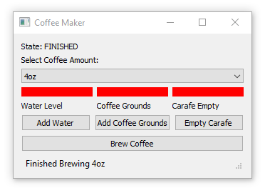
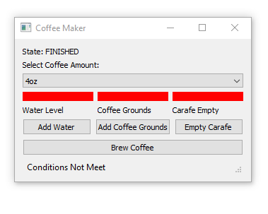

# Explanation

The objective is to develop a model-based artificial intelligence system. After careful consideration, I have chosen to focus on creating an AI specifically designed for a coffee maker. A model-based AI encompasses several essential elements. Firstly, it requires sensors to gather information from its surrounding environment. This information serves as input for the AI to comprehend the current state of affairs. Secondly, the AI needs to possess an understanding of how the world evolves, allowing it to anticipate changes and make informed decisions. Furthermore, it must grasp the potential consequences of its actions, thereby ensuring it operates effectively. Ultimately, the purpose of all these components is to enable the AI to comprehend the present condition of the world and act accordingly.

Once the agent has gathered information and comprehended the current state, it must proceed to determine the most suitable course of action. This decision-making process involves considering condition-action rules, which guide the agent's choices. Subsequently, once the decision has been made, the agent utilizes actuators to enact the desired changes in the environment.

In the specific context of the coffee maker, we employ three sensors to monitor critical aspects. The first sensor assesses whether the water level is appropriate, ensuring it is neither overfilled nor insufficiently filled. The second sensor verifies the presence of usable coffee grounds within the machine. Lastly, the third sensor detects whether the carafe has been removed from its position.

The coffee maker operates within three distinct states: Idle, Brewing, and Finished. The model transitions from one state to another based on specific conditions that must be satisfied. This interplay between states and conditions dictates the behavior and progression of the coffee maker's functionality.

From **Idle** to **Brewing**: When the user presses the "Brew" button and all sensors return true, the coffee maker transitions from the Idle state to the Brewing state.

From **Brewing** to **Finished**: Once brewing is complete, the coffee maker transitions from the Brewing state to the Finished state. This is represented by a timer.

From **Finished** to **Idle**: The coffee maker can transition back to the Idle state if the user decides to remove the carafe and replace the water and coffee grounds.

To ensure that the model remains updated with the changing world/environment, all relevant changes are diligently recorded. To demonstrate this capability, the model incorporates a graphical user interface (GUI) equipped with LEDs and a status bar. These visual elements serve as indicators, reflecting the recorded changes in real-time.

For example, the LEDs on the GUI can be programmed to represent different aspects of the coffee maker system, such as water level, presence of coffee grounds, or carafe status. As the model captures changes in these parameters, the corresponding LEDs will illuminate or extinguish accordingly, providing a visual representation of the current state.

Additionally, the status bar on the GUI can display textual information or icons that depict the system's status or any notable updates. This status bar acts as a dynamic feedback mechanism, keeping the user informed about the ongoing processes and changes within the coffee maker system.

By incorporating these visual cues, the GUI effectively showcases the model's ability to track and respond to environmental changes. The LEDs and status bar create a user-friendly interface that facilitates understanding and interaction, ensuring transparency and enhancing the overall user experience.

A couple of assumptions are made about our system, which serve to simplify its complexity:

1. The user will actively participate in the coffee-making process by adding the appropriate amount of water, replacing the coffee grounds, and emptying the carafe between brews.
2. It is assumed that the user will add the correct amount of water based on the selected coffee size, ensuring an optimal brewing experience.
3. Whenever the carafe is removed from the coffee maker, it is expected that all of the previously brewed coffee will be discarded.
4. The carafe is initially empty at the start of the coffee-making process.
5. The system assumes that a filter is already installed and does not require regular replacement.

These assumptions provide a framework for the functioning and user interactions within the coffee maker system.

The program operates through the utilization of two classes, each serving distinct purposes. The first class is a data class designed to store the relevant information pertaining to the coffee maker system. It ensures the proper storage and organization of input data, such as sensor readings. The second class is a behavioral class responsible for implementing the system's functionalities and making decisions based on the provided inputs.

[Video Explanation](https://youtu.be/3WNQC9qRhIk)

## Display on startup

## Brewing

## Finished

## Condions not met error
